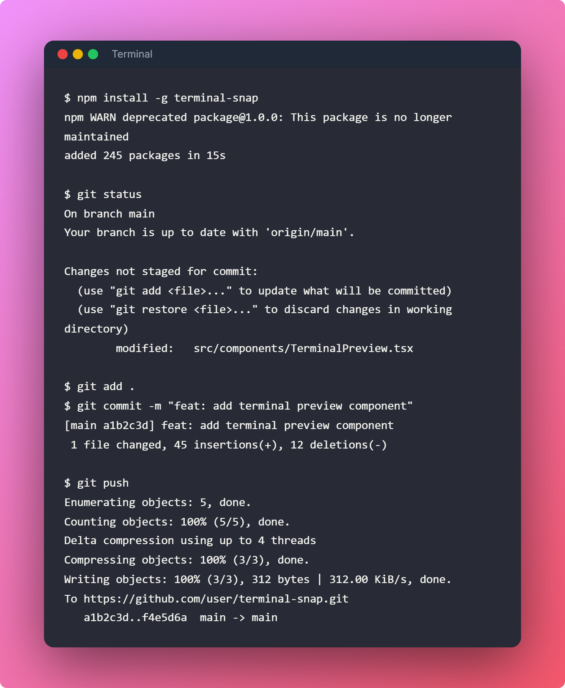

# TerminalSnap

<div align="center">
    
</div>

[](https://nextjs.org/)
[](https://www.typescriptlang.org/)
[](https://opensource.org/licenses/MIT)
[]()

A beautiful terminal screenshot beautifier built with Next.js. Create stunning terminal screenshots for your documentation, blogs, and presentations.

**Live at [terminalsnap.online](https://www.terminalsnap.online/)**

Featuring a **modern glassmorphic dark theme** with animated mesh gradient backgrounds and floating label form design.

## Features

- 🎨 **10 Beautiful Themes**: Dracula, Nord, One Dark, Gruvbox Dark, Tokyo Night, Solarized Light, GitHub Light, and 3 Catppuccin variants (Mocha, Frappe, Macchiato)
- 🖼️ **Custom Backgrounds**: Choose from 15+ preset backgrounds including gradients, solid colors, and macOS-inspired abstract wallpapers
- 🪟 **OS Window Styles**: macOS, Windows, Linux, or minimal window decorations
- 🎯 **ANSI Color Support**: Full support for ANSI escape sequences and color codes
- 💻 **Shell Auto-Detection**: Automatically detect bash, zsh, or PowerShell from your terminal output
- 📸 **High-Quality Export**: Export your terminal screenshots as PNG images with optional drop shadows
- ⚡ **Real-time Preview**: See your changes instantly as you customize
- 🎨 **Fully Client-Side**: No backend required, everything runs in your browser
- 🌙 **Glassmorphic Dark UI**: Modern dark theme with animated mesh gradient background, floating labels, and cyan/blue accents
- 📐 **Customizable Padding & Orientation**: Adjust horizontal and vertical padding for landscape/portrait orientations
- 🔤 **Syntax Highlighting**: Professional syntax highlighting powered by Shiki
- 🌈 **Transparent Background**: Option to make outer padding area transparent while keeping terminal window solid

## Upcoming Features

- 🎨 Hand Drawn Excalidraw styled Terminal Themes
- 🖼️ Custom Background Functionality
- 🔤 Change Terminal Fonts functionality
- 📋 Copy to Clipboard actions
- 🔗 Share to X, Medium, LinkedIn + Iframe functionality
- 🖼️ Export to SVG functionality + open as link in new tab
- 💾 Persist your own config functionality
- 🚀 New Feature Request functionality 

## Development

For development setup instructions, see [Quickstart.md](Quickstart.md)

## Usage

1. **Paste Terminal Output**: Paste your terminal output into the text area
2. **Choose Theme**: Select from 10 beautiful terminal themes including Catppuccin variants
3. **Select Background**: Pick from 15+ backgrounds including gradients, solid colors, and macOS-inspired wallpapers
4. **Customize Window**: Choose your OS window style and optional title
5. **Adjust Settings**: Configure padding, orientation, drop shadow, and transparent background
6. **Export**: Click "Export as PNG" to download your beautiful terminal screenshot

## Tech Stack

- **Framework**: Next.js 14+ (App Router)
- **Language**: TypeScript 5.3+
- **Styling**: Tailwind CSS with custom CSS (pure React components)
- **Design**: Glassmorphic dark theme with floating labels
- **ANSI Parsing**: ansi-to-react
- **Syntax Highlighting**: Shiki
- **Export**: html-to-image
- **Testing**: Jest + React Testing Library
- **Code Quality**: ESLint + Prettier

## Project Structure

```
terminal-snap/
├── src/
│   ├── app/              # Next.js app router pages
│   │   ├── globals.css   # Global styles & glassmorphic theme
│   │   ├── layout.tsx    # Root layout with dark theme
│   │   └── page.tsx      # Main application page
│   ├── components/       # React components
│   │   ├── ui/           # Glassmorphic UI primitives
│   │   │   ├── floating-input.tsx
│   │   │   ├── floating-textarea.tsx
│   │   │   ├── floating-select.tsx
│   │   │   ├── modern-checkbox.tsx
│   │   │   ├── modern-radio.tsx
│   │   │   ├── modern-slider.tsx
│   │   │   ├── modern-button.tsx
│   │   │   └── glass-card.tsx
│   │   ├── Navbar.tsx              # Top navigation bar with GitHub link
│   │   ├── BackgroundSelector.tsx  # Background preset selector
│   │   ├── DropShadowToggle.tsx    # Drop shadow toggle
│   │   ├── ExportButton.tsx        # PNG export button
│   │   ├── OSChromeToggle.tsx      # OS window style selector
│   │   ├── OrientationSelector.tsx # Portrait/landscape toggle
│   │   ├── PaddingSelector.tsx     # Padding adjustment controls
│   │   ├── ShellTypeSelector.tsx   # Shell type selector
│   │   ├── TerminalPreview.tsx     # Terminal preview renderer
│   │   ├── TextInput.tsx           # Terminal output text input
│   │   └── ThemeSelector.tsx       # Theme selector
│   ├── lib/              # Utilities and configurations
│   │   ├── ansi-parser.tsx         # ANSI escape sequence parser
│   │   ├── backgrounds.ts          # Background preset definitions
│   │   ├── export.ts               # PNG export functionality
│   │   ├── syntax-highlighter.ts   # Syntax highlighting with Shiki
│   │   ├── themes.ts               # Terminal theme definitions
│   │   └── utils.ts                # Utility functions
│   └── types/            # TypeScript type definitions
├── public/               # Static assets
│   ├── readme/            # README assets
│   │   └── hero.png               # Hero image
│   ├── hero.svg                  # Hero logo
│   ├── hero-with-subtitle.svg    # Hero with subtitle
│   └── icon.svg                  # Favicon icon
├── features/             # Cucumber feature files (BDD tests)
├── plans/                # Project planning documents
├── jest.config.js        # Jest configuration
└── package.json
```


## Design System

TerminalSnap uses a custom **glassmorphic dark theme** design:

- **Mesh Gradient Background**: Animated blurred color blobs in cyan, blue, and purple
- **Glassmorphic Components**: Semi-transparent backgrounds with backdrop blur
- **Floating Labels**: Animated labels that float above inputs on focus/content
- **Accent Colors**: Cyan (#06b6d4) and blue (#3b82f6) gradients
- **Dark Base**: Deep dark blue (#050816) background

## Contributing

Contributions are welcome! Please feel free to submit a Pull Request.

1. Fork the repository
2. Create your feature branch (`git checkout -b feature/AmazingFeature`)
3. Commit your changes (`git commit -m 'Add some AmazingFeature'`)
4. Push to the branch (`git push origin feature/AmazingFeature`)
5. Open a Pull Request

## License

This project is open source and available under the [MIT License](LICENSE).

## Acknowledgments

- Inspired by [carbon.now.sh](https://carbon.now.sh)
- Glassmorphic design inspired by modern UI trends
- Terminal themes inspired by popular terminal color schemes
